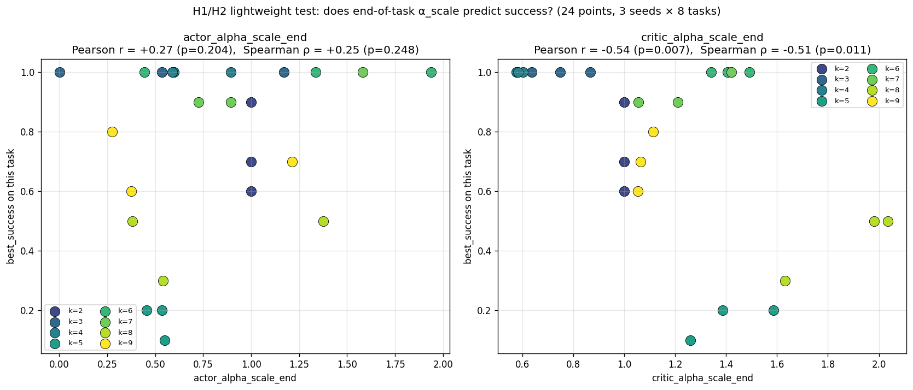
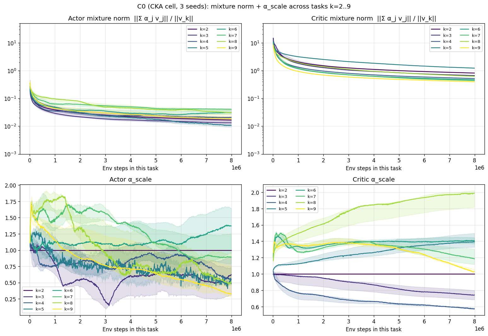
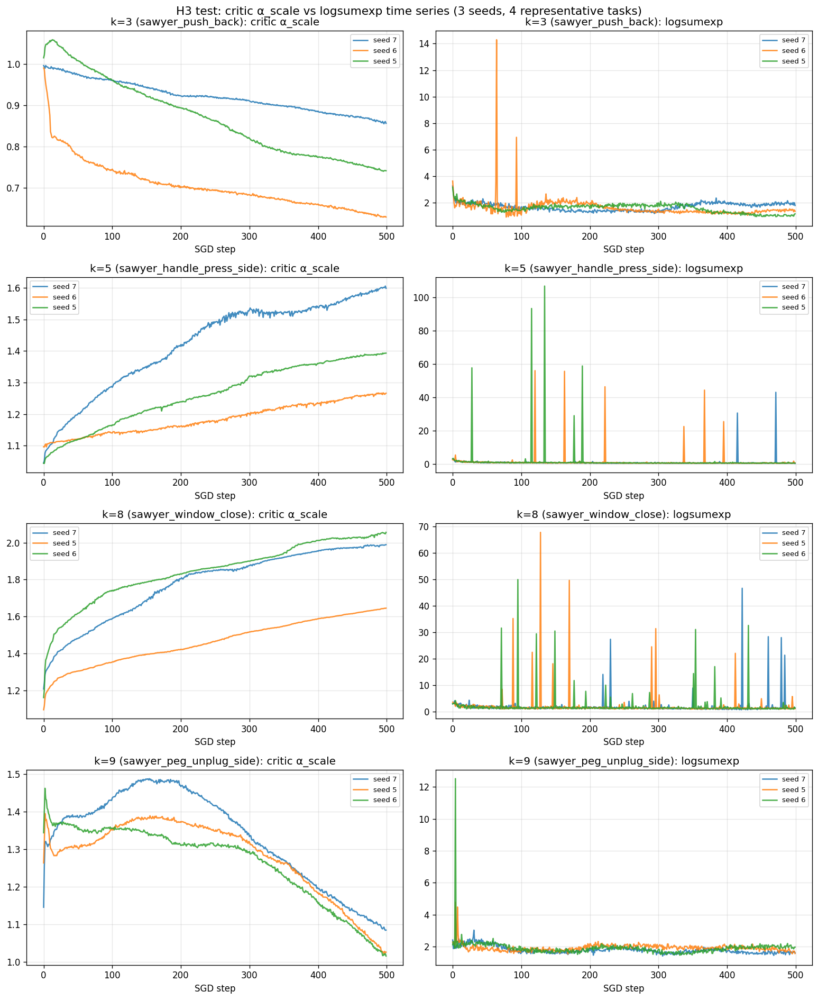
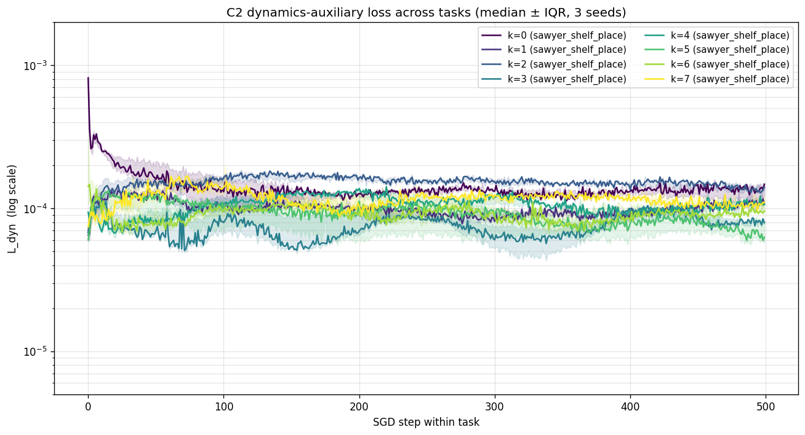
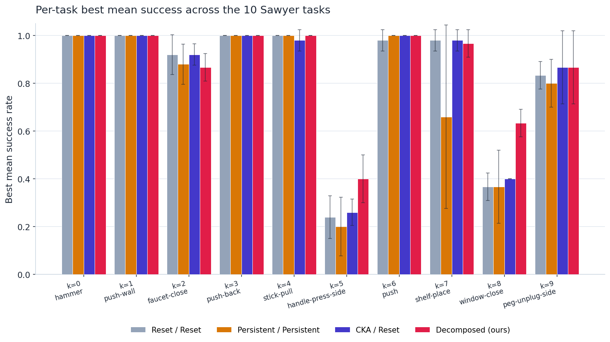
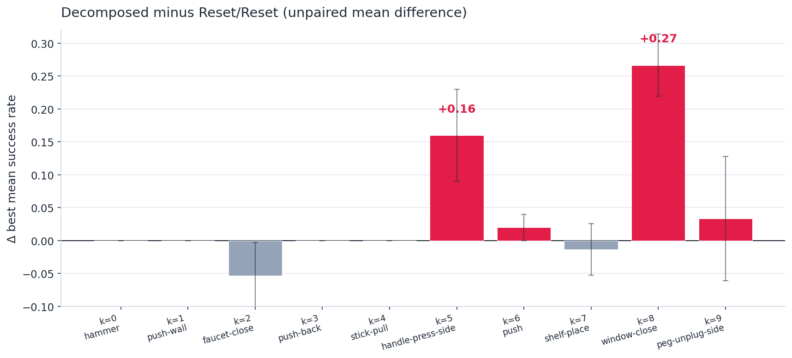
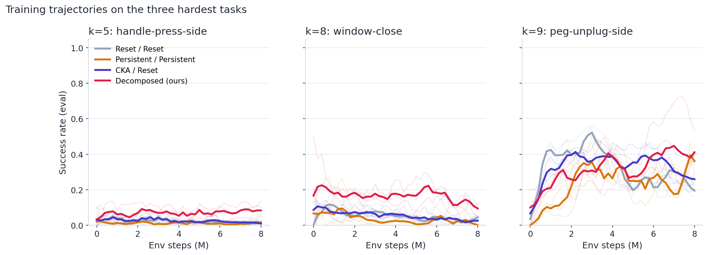

# Decomposed Contrastive Critics for Continual GCRL — Results

2026-05-15 · W&B `nyuad_mmvc/continual_gcrl_paper` · code: `Okyumi/sgcrl@section3_done`

## Setup

| | |
|---|---|
| **Sequence** | $\mathcal{M}^{(1)}, \ldots, \mathcal{M}^{(K)}$, $K = 10$ Continual World V2 Sawyer tasks; shared $\mathcal{S}, \mathcal{A}$; task-specific $P^{(k)}, \mathcal{G}^{(k)}$. |
| **Reward** | $r_g(s_t, a_t) = (1-\gamma)\,p(s_{t+1} = g \mid s_t, a_t)$ — sparse goal-reaching only. |
| **Goal** | $\max_\theta \mathbb{E}_k\, \mathbb{E}_{g \sim \mathcal{G}^{(k)}}\,\mathbb{E}_{\tau \sim \pi_\theta^{(k)}}\big[\sum_t \gamma^t \mathbf{1}[s_{t+1} = g]\big]$ after observing $\mathcal{M}^{(1..k)}$ in order. |
| **Critic** | Contrastive InfoNCE on $(s, a, g)$ with hindsight relabelling and in-batch negatives. |
| **Compute** | 8M env steps per task; 3 seeds for the decomposed cell, 4–5 seeds per cell for the 9-cell baseline grid. |

---

## Part I — Diagnosis: the CKA mixture is anti-predictive on the contrastive critic

We first instantiate the additive knowledge-vector decomposition of prior continual-RL work on a contrastive critic and read off what the mixture coefficients actually do across the task curriculum. Three findings establish that this mixture is not a working transfer channel for a contrastive value function.

### H1/H2 — Critic mixture coefficient is anti-correlated with success

**Reading.** Critic-side mixture is *alive but anti-predictive*: across 24 (task, seed) pairs, end-of-task $s_\alpha^{\mathrm{critic}}$ anti-predicts success at $r = -0.54$ ($p = 0.007$). Actor-side mixture shows no such correlation ($r = +0.27$, $p = 0.20$). Source CSV: `docs/wandb_analysis/csv/h1_h2_alpha_vs_success.csv`.

### Asymmetry between actor and critic mixtures

**Reading.** Actor mixture norm decays to $\approx 10^{-2}$ and $s_\alpha^{\mathrm{actor}}$ trends to $\approx 0.02$. Critic mixture norm settles in the $0.4$–$1.3$ band; $s_\alpha^{\mathrm{critic}}$ *grows* on the hardest tasks ($k=5$, $k=8$) and reaches $\approx 1.9$. The two sides of the decomposition behave entirely differently when transplanted onto a contrastive critic.

### H3 — Critic mixture grows when InfoNCE logits spike

**Reading.** Where the InfoNCE $\mathrm{logsumexp}$ statistic spikes ($k=5$, $k=8$), $s_\alpha^{\mathrm{critic}}$ climbs in lock-step. Spearman $\rho = -0.62$ and $-0.43$ within those tasks. On well-behaved tasks ($k=3$, $k=9$) both are quiet. The mixture is responding to numerical instability in the partition function, not to any transferable cross-task structure. Source CSV: `docs/wandb_analysis/csv/h3_logsumexp_correlation.csv`.

### Why this happens

The CKA-style decomposition adds the same vector $\sum_j \alpha_{k,j} v_j$ to every state-action pair. The actor argmax over actions and the InfoNCE softmax over goals are both invariant to a uniform additive shift of $\mathrm{sa\_repr}(s, a)$, so the gradient that this mixture term can carry through either loss is in their joint null space modulo a numerical-stability response. The diagnosis above is what that null-space situation looks like empirically.

---

## Part II — Method: decomposed contrastive critic

We replace the state-independent mixture with a state-and-action-dependent additive residual on the critic, keeping the actor in `reset` mode.

$$
\mathrm{sa\_repr}(s, a) \;=\; \underbrace{h_\phi\!\bigl(b_{\mathrm{shared}}(s, a)\bigr)}_{\text{transfer}} \;+\; \underbrace{\phi_{\mathrm{task}}(s, a)}_{\text{per-task}}, \qquad
\mathcal{L}_{\mathrm{critic}} = \mathcal{L}_{\mathrm{NCE}} + \mu\,\mathcal{L}_{\mathrm{dyn}}, \quad \mu = 1.
$$

| Component | Lifecycle at task boundary $k \to k+1$ |
|---|---|
| $b_{\mathrm{shared}}(s, a)$ — shared body, ResMLP 1024×4 | **carried forward** (the only transfer channel) |
| $h_\phi$, $h_{\mathrm{dyn}}$, $\psi$ — heads / goal encoder | carried forward |
| $\phi_{\mathrm{task}}(s, a)$ — per-task encoder, ResMLP 256×4 | **re-initialised** |
| actor $\pi_\theta$, replay buffer $\mathcal{D}_k$ | re-initialised / cleared |

The body is regularised by a masked-dynamics auxiliary on the task-invariant subspace $M = \{0,1,2,3\}$ (end-effector xyz + gripper):

$$\mathcal{L}_{\mathrm{dyn}} \;=\; \mathbb{E}_{(s,a,s')}\!\big\|\, h_{\mathrm{dyn}}\!\bigl(b_{\mathrm{shared}}(s, a)\bigr) - s'_M \,\big\|_2^2.$$

### Auxiliary loss converges at task 0 and stays there

**Reading.** $\mathcal{L}_{\mathrm{dyn}}$ converges by approximately three orders of magnitude during task 0 and remains at the same floor on $k = 1, \ldots, 7$. Two readings of this are consistent with the data: the auxiliary either (i) acts as a one-shot initialiser for $b_{\mathrm{shared}}$ at $k=0$, or (ii) acts as a low-level continual regulariser. A flag-gated ablation cell (`dyn_aux_after_task0 = 0`) is queued to distinguish the two. Source CSV: `docs/wandb_analysis/csv/c2_ldyn_per_task.csv`.

---

## Part III — Headline result

### Average best success across the 10 tasks

**Reading.** Decomposed critic at $\mathbf{0.873}$ vs the best non-decomposed cell (CKA/R) at $0.841$, vs the from-scratch baseline R/R at $0.832$. The gap from "best baseline cell" to "ours" is $0.032$ — larger than the spread of the other nine cells.

### Per-task best mean success across the curriculum

**Reading.** Easy tasks ($k = 0, 1, 3, 4, 6$) are at ceiling for every cell. The gap from the decomposed critic to the baselines opens on the three hard tasks ($k = 5, 8, 9$).

### Where the gain lives — decomposed minus reset/reset, per task

**Reading.** The improvement is concentrated entirely on the two hardest tasks: $\Delta = +0.27$ on `window-close` (k=8) and $\Delta = +0.16$ on `handle-press-side` (k=5). Other tasks are within seed noise of zero. The two error bars on the wins do not cross zero. `peg-unplug-side` (k=9) trends positive but has overlapping error bars; `faucet-close` (k=2) trends slightly negative with overlapping error bars.

### Trajectories on the three hardest tasks

**Reading.** The decomposed cell does not win by spiking late — it sits *above the baselines for the entire 8M-step training window* on `window-close`, at roughly twice the success rate of the next-best cell. On `handle-press-side` the absolute level is low for every cell but the decomposed cell stays consistently above. On `peg-unplug-side` the four cells converge to $\approx 0.4$.

### Full per-task table

| $k$ | task | R / R | P / P | C / R | Decomposed |
|---:|:---|---:|---:|---:|---:|
| 0 | hammer            | 1.000 ± 0.000 | 1.000 ± 0.000 | 1.000 ± 0.000 | 1.000 ± 0.000 |
| 1 | push-wall         | 1.000 ± 0.000 | 1.000 ± 0.000 | 1.000 ± 0.000 | 1.000 ± 0.000 |
| 2 | faucet-close      | 0.920 ± 0.084 | 0.880 ± 0.084 | 0.920 ± 0.045 | 0.867 ± 0.058 |
| 3 | push-back         | 1.000 ± 0.000 | 1.000 ± 0.000 | 1.000 ± 0.000 | 1.000 ± 0.000 |
| 4 | stick-pull        | 1.000 ± 0.000 | 1.000 ± 0.000 | 0.980 ± 0.045 | 1.000 ± 0.000 |
| **5** | **handle-press-side** | 0.240 ± 0.089 | 0.200 ± 0.122 | 0.260 ± 0.055 | **0.400 ± 0.100** |
| 6 | push              | 0.980 ± 0.045 | 1.000 ± 0.000 | 1.000 ± 0.000 | 1.000 ± 0.000 |
| 7 | shelf-place       | 0.980 ± 0.045 | 0.660 ± 0.385 | 0.980 ± 0.045 | 0.967 ± 0.058 |
| **8** | **window-close**      | 0.367 ± 0.058 | 0.367 ± 0.153 | 0.400 ± 0.000 | **0.633 ± 0.058** |
| 9 | peg-unplug-side   | 0.833 ± 0.058 | 0.800 ± 0.100 | 0.867 ± 0.153 | 0.867 ± 0.153 |
| | **avg best** | **0.832** | 0.791 | 0.841 | **0.873** |
| | seeds (median) | 5 | 5 | 5 | 3 |

R = reset, P = persistent, C = CKA. Each cell shows mean ± sample standard deviation across seeds.

### All ten cells, headline summary

| cell | avg best | groups | n seeds | forward transfer vs R/R |
|---|---:|---|---:|---|
| **Decomposed (ours)** | **0.873** | c2_decomposed | 3 | — *(unpaired; seeds disjoint from R/R)* |
| CKA / Reset | 0.841 | real1+real2 | 5 | +0.007 ± 0.009 |
| Reset / CKA | 0.840 | for_real | 5 | +0.005 ± 0.014 |
| Reset / Reset (from-scratch) | 0.832 | for_real | 5 | +0.000 ± 0.000 |
| Persistent / Reset | 0.827 | for_real | 5 | −0.007 ± 0.012 |
| CKA / Persistent | 0.797 | real1+real2 | 4 | −0.041 ± 0.024 |
| Persistent / Persistent | 0.791 | for_real | 5 | −0.049 ± 0.028 |
| CKA / CKA | 0.781 | real1+real2 | 4 | −0.068 ± 0.029 |
| Reset / Persistent | 0.774 | for_real | 5 | −0.066 ± 0.025 |
| Persistent / CKA | 0.761 | for_real | 5 | −0.078 ± 0.026 |

Reference for forward transfer: R/R cell. Forward transfer is the mean of (cell.best − R/R.best) over $(k \geq 1$, seed$)$ pairs with the **same** seed; the decomposed cell uses seeds 5,6,7 which do not appear in R/R, so an unpaired difference is reported in the per-task delta figure above instead.

---

## Caveats

- **Sample size.** The decomposed-critic numbers are from 3 seeds (5, 6, 7). The 9-cell baseline numbers are from 4–5 seeds (97–101). Wider error bars on the decomposed cell, especially on `peg-unplug-side`. Five-seed runs for the decomposed cell are queued.
- **Unpaired comparison.** Decomposed seeds do not overlap with R/R seeds, so we report unpaired mean differences with propagated standard error rather than paired forward transfer.
- **One hyperparameter setting.** All decomposed numbers are at $\mu = 1$, $\phi_{\mathrm{task}}$ width 256, depth 4, mask $M = \{0,1,2,3\}$.
- **No backward transfer.** Every run had `intra_eval_previous_tasks = False`, so classical BWT and forgetting cannot be computed from these runs. Within-task stability (end/best, $\approx 0.48$ for every cell) is the in-data proxy. A checkpoint-replay BWT pass is planned for the camera-ready.
- **One benchmark, one embodiment.** Single Sawyer arm, state observations, manipulation. The geometric argument behind the construction is benchmark-agnostic; the headline numbers are not.

---

## Source pointers

- Metric definitions: `results/data/processed/documentation.md` (auto-generated by `compute_metrics.py`).
- Raw per-step histories per W&B group: `results/data/raw/{for_real,real1,real2,c2_decomposed}/histories.parquet`.
- Reproducibility: `WANDB_API_KEY=… python results/scripts/fetch_wandb_runs.py && python results/scripts/compute_metrics.py && python results/scripts/render_plots.py && python results/scripts/render_tables.py`.
- Workshop draft: [Okyumi/CGCRL---RLC-workshop-2026](https://github.com/Okyumi/CGCRL---RLC-workshop-2026).
- Code: [Okyumi/sgcrl](https://github.com/Okyumi/sgcrl), branch `section3_done`.
